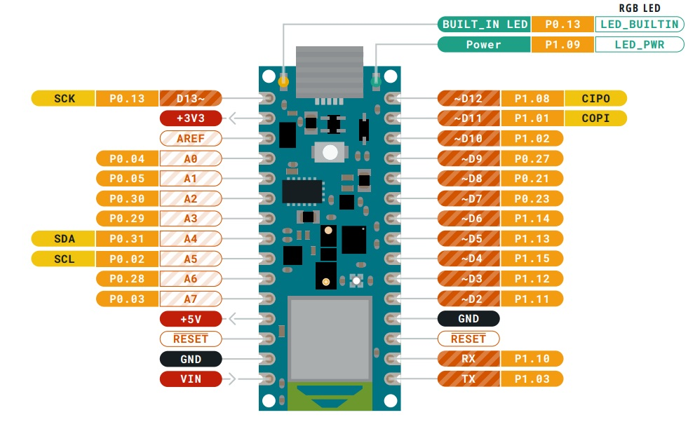
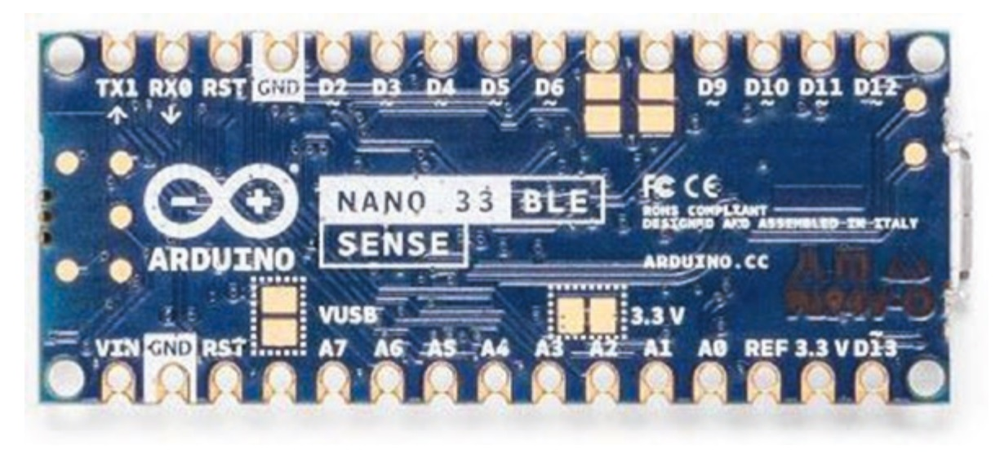
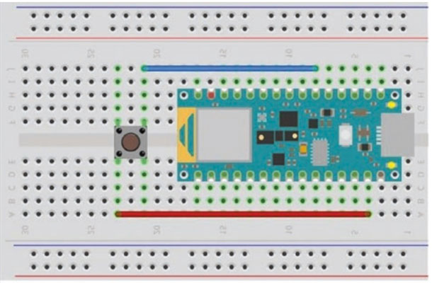
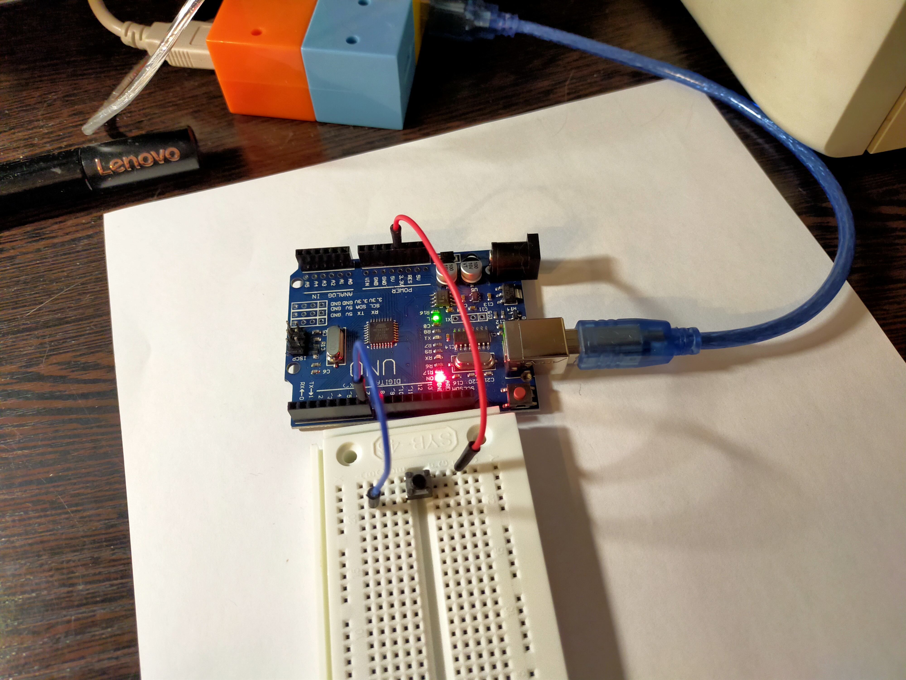
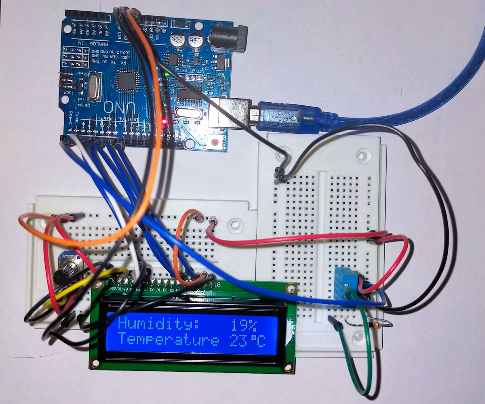
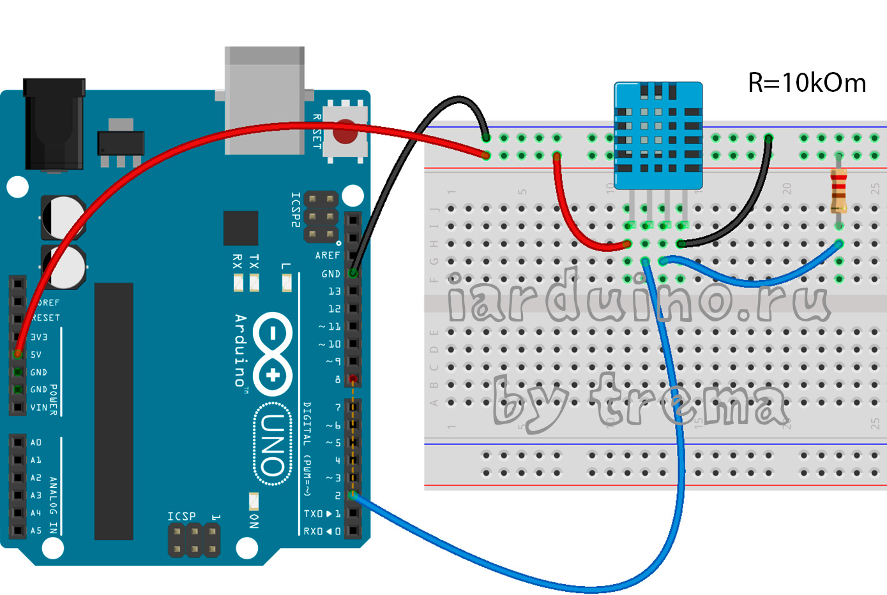
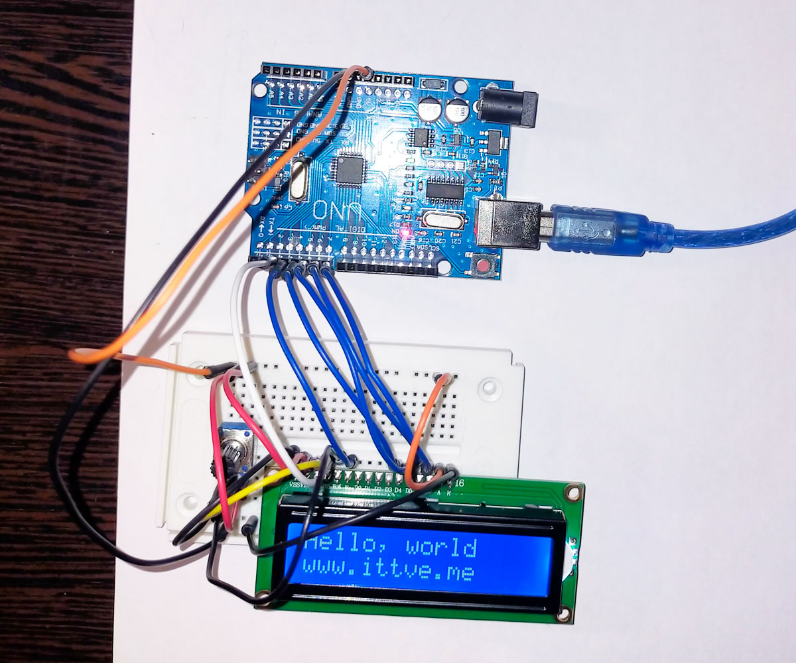

### Проекты Интернета вещей с Arduino Nano 33 BLE Sense - Агус Курниаван

Знакомство с книгой Агуса Курниавана "Проекты Интернета вещей с Arduino Nano 33 BLE Sense" и программирование примеров из неё. 



Расположение выводов Arduino Nano 33 BLE Sense отображается на задней стороне платы. Пины цифрового ввода / вывода определяются как Dx, где x - цифровое число; например, D1 - это цифровой ввод / вывод на выводе 1.

[Arduino Nano 33 BLE Sense](https://docs.arduino.cc/hardware/nano-33-ble-sense) сочетает в себе крошечный форм-фактор, различные датчики окружающей среды и возможность запуска искусственного интеллекта с использованием TinyML и TensorFlow ™ Lite. 

Для программирования контроллера следует установить пакет Mbed OS Nano Boards, который основан на Arduino Mbed Core и включает следующие платы:

Nano RP2040 Connect
Nano 33 BLE
Nano 33 BLE Sense
Nano 33 BLE Sense Rev2.

Вы можете установить этот пакет в диспетчере плат для <b>IDE 2</b>, выполнив поиск "Платы Arduino Mbed OS Nano". Подробные инструкции см. в разделе [Установка пакета платы](https://docs.arduino.cc/software/ide-v2/tutorials/ide-v2-board-manager#installing-a-board-package).

Достаточно полная информация по микроконтроллеру размещена в двух статьях Амперки:

##### [Arduino Nano 33 BLE Sense](https://amperka.ru/product/arduino-nano-33-ble-sense?utm_source=man&utm_campaign=arduino-nano-33-ble&utm_medium=wiki#libs) - полный аналог Nano 33 BLE, но на борту версии Sense добавлена целая группа датчиков;

##### [Распиновка, схема подключения и программирование](http://wiki.amperka.ru/products:arduino-nano-33-ble-sense?parent-baobab-id=lrd98bmyx3) - родным напряжением Arduino Nano 33 BLE Sense является 3,3 В, а не 5 В. Выходы для логической единицы выдают 3,3 В, а в режиме входа ожидают принимать не более 3,3 В. Большее напряжение может повредить микроконтроллер!

##### [Оригинальный материал: Boards Nano-33-ble-sense ](https://github.com/arduino/docs-content/tree/main/content/hardware/03.nano/boards/nano-33-ble-sense) - процессор Cortex M4F на частоте до 64 МГц. Контакты A4 и A5 имеют внутренний вывод и по умолчанию используются как шина ввода-2C, поэтому использовать их в качестве аналоговых входов не рекомендуется. Криптографический чип обеспечивает безопасный способ хранения сертификатов и ускоряет работу защищенных протоколов.

[U-blox NINA-B306]() - обеспечивает связь Bluetooth v5.0 в диапазоне 2,4 ГГц и поддерживает энергосберегающий протокол Bluetooth Low Energy (BLE);

[Nordic nRF52840]() - 32-битный микроконтроллерна архитектуре ARM Cortex-M4 с тактовой частотой 64 МГц, 1 МБ флеш-памяти и 256 КБ оперативной памяти. Вычислительный блок операций с плавающей запятой (FPU) ускоряет работу с вещественными числами.

[STMicroelectronics LSM9DS1](LSM9DS1/LSM9DS1.ino) - инерциальный модуль с трёхосевыми сенсорами: акселерометр, гироскоп и магнитометр (IMU-сенсор на 9 степеней свободы). Датчики движения снабжают устройство мгновенными данными о перемещении в пространстве.

[STM HTS221]() - датчик, определяющий температуру и относительную влажность воздуха в окружающем пространстве и выдаёт их значения в 16-битном формате.

[STM LPS22HB]() - датчик атмосферного давления, служащий альтиметром для носимого гаджета или барометром для метеостанции.

 [Avago APDS-9960]() - cенсор от Broadcom, использующий четыре фотодиода с ИК-излучателями для распознавания базовых жестов: взмаха руки влево или вправо, вверх-вниз и так далее. Также он умеет распознавать цвета через интенсивность каналов RGB и уровень освещённости.

[STM MP34DT05-A (MP34DT06JTR)](MP34DT06JTR/MP34DT06JTR.ino) - встроенный цифровой микрофон для распознавания коротких голосовых команд или записи звука.

С помощью алгоритма машинного обучения TensorFlow Lite можно найти интересное применение для всей комбинации сенсоров: например, научить Arduino сортировать фрукты.


### Проекты

#### [AnalogSensor - аналоговый ввод / вывод](AnalogSensor/AnalogSensor.md)

#### [ButtonLed -  цифровой ввод-вывод](#buttonled)

#### [ClearEEPROM - очистка энергонезависимой памяти контроллера](#cleareeprom)

#### [Dht11 - подключение датчика DHT11 и вывод показаний температуры и влажности на LCD 1602a дисплей](#dht11)

#### [MemoryGuide - руководство по памяти Arduino](MemoryGuide/MemoryGuide.md) 

---

#### ButtonLed
#### Цифровой ввод-вывод

Чтобы реализовать демонстрацию цифрового ввода-вывода на Arduino Nano 33 BLE Sense, нам понадобится светодиод и кнопка. Для этих примеров используйте внутренний светодиод (встроенный светодиод) на цифровом контакте 13. Нам также понадобится кнопка, подключенная к цифровому контакту 7. 







###### [к списку проектов](#%D0%BF%D1%80%D0%BE%D0%B5%D0%BA%D1%82%D1%8B)

---

#### Dht11
#### [Подключение датчика DHT11 и вывод показаний температуры и влажности на LCD 1602a дисплей]()

В этом примере выполняется подключение датчика и дисплея к контроллеру Arduino Uno.



Для реализации проекта нам необходимо установить библиотеки:

[библиотека LiquidCrystal_I2C1602V1](https://iarduino.ru/file/134.html), [библиотека для подключения DHT11](https://www.arduino.cc/reference/en/libraries/dht11/)

1) Подключение DHT11 к Arduino Uno:
```
    DHT11	Arduino
    
1 контакт	5V
2 контакт	Pin 2
3 контакт	Через резистор 10 kOm к 5V
4 контакт	GND
```


2) Подключение символьного дисплея LCD1602a к Arduino Uno, на который будет выводиться информация о температуре и влажности.
```
// Подключаем штатную библиотеку LiquidCrystal.h
#include <LiquidCrystal.h>
// Создаем объект дисплея на заданных контактах
//            [RS, E, D4, D5, D6, D7] 
LiquidCrystal  (3, 4,  5,  6,  7,  8);

Подключение дисплея к макетной плате осуществляем через штыревые контакты PLS-16 (здесь выполняем 4-разрядное подключение с помощью контактов от DB4 до DB7) следующим образом:

VDD (2-й контакт) к +5V (Arduino) - подключим питание;
VSS (1-й контакт) к GND (Arduino);
RS  (4-й контакт) подключаем к цифровому контакту 3 (Arduino);
RW  (5-й контакт) заземляем, подключив его к GND (Arduino);
E подключаем к контакту 4 (Arduino);
контакты DB4 (11-й контакт), DB5 (12-й контакт), DB6 (13-й контакт) и DB7 (14-й контакт) подключаем к цифровым выводам Arduino 5, 6, 7 и 8. 
V0 (3-ий пин) подключаем к центральному контакту потенциометра 10K, который используем для регулировки контрастности дисплея.
В завершение A (15 пин) заводим тоже на +5V, а K (16 пин) на землю (GND).
```



[Код скетча: ](Dht11v3/Dht11v3.ino)
```
/* ========================================================================= */
/*   Dht11v2.ino                                                             */
/*   (c) 2023-12-18 Труфанов Владимир                                        */
/*                                                                           */
/*   Description:      скетч снятия показаний с датчика DHT11 (с библиотекой */ 
/*                 версии DHT11-1.0.0) и вывода значений на дисплей LCD1602a */
/* ========================================================================= */

#include <Wire.h>
// Include the DHT11 library for interfacing with the sensor.
#include "DHT11.h"
// Подключаем штатную библиотеку LiquidCrystal.h
#include <LiquidCrystal.h>

// Создаем объект дисплея на заданных контактах
//               [RS, E, D4, D5, D6, D7] 
LiquidCrystal lcd (3, 4,  5,  6,  7,  8);   
// Создаем объект датчика DHT11 на 2 пине
// - For Arduino: Connect the sensor to Digital I/O Pin 2.
// - For ESP32: Connect the sensor to pin GPIO2 or P2.
// - For ESP8266: Connect the sensor to GPIO2 or D4.
#define DHT11PIN 2
DHT11 sensor(DHT11PIN);

byte degree[8] = // кодируем символ градуса
{
  B00111,
  B00101,
  B00111,
  B00000,
  B00000,
  B00000,
  B00000,
};

void setup()
{
   // Инициируем дисплей на 16 столбцов и 2 строки (LCD 16x2)
   lcd.begin(0x27,16,2); 
   // Создаем символ под номером 1 
   lcd.createChar(1, degree); 
}

void loop()
{
   // Wait for 1 seconds before the next reading.
   delay(1000);
   lcd.setCursor(0, 0);
   // Read the humidity from the sensor.
   int humidity = sensor.readHumidity();
   // If the humidity reading was successful, print it to the serial monitor.
   if (humidity != -1)
   {
     lcd.print("Humidity:     %");
     lcd.setCursor(12, 0);
     lcd.print(humidity);
   }
   else
   {
      // If the humidity reading failed, print an error message.
      lcd.print("Error humidity");
   }
   
   lcd.setCursor(0, 1);
   int temperature = sensor.readTemperature();
   if (temperature != -1)
   {
      lcd.print("Temperature   \1C");
      lcd.setCursor(12, 1);
      lcd.print(temperature);
   }
   else
   {
      lcd.print("Error temperature");
   }
   delay(2000);
}
```
И два ознакомительных скетча:

[Проверка подключения дисплея LCD1602a в различных   версиях Arduino IDE: 1.8.18 и 2.2.1 ](OnlyLCD1602a/OnlyLCD1602a.ino);

[Cкетч для иллюстрации совместного подключения на двух макетных платах LCD1602a и DHT11 (с библиотекой версии DHT11-2.0.0)](Dht11v2/Dht11v2.ino).

###### [к списку проектов](#%D0%BF%D1%80%D0%BE%D0%B5%D0%BA%D1%82%D1%8B)

---

#### ClearEEPROM
#### Очистка энергонезависимой памяти контроллера

EEPROM (англ. Electrically Erasable Programmable Read-Only Memory) — электрически стираемое перепрограммируемое ПЗУ.

В общем, после нескольких загрузок при очередной загрузке скетча (Arduino 1.8.18) вышло сообщение, что места маловато и могут быть сбои при работе программы (Arduino 2.2.1 такого сообщения не выдавало), решил занятся вопросом.

***[Как сбросить память Arduino - https://citavers.ru/2023/10/25/kak-sbrosit-pamyat-arduino](https://citavers.ru/2023/10/25/kak-sbrosit-pamyat-arduino)***

Для различных моделей Arduino могут быть разные объёмы памяти и разные методы очистки памяти. В этой статье мы сосредоточимся на общих методах, которые будут полезны для большинства моделей Arduino.

Существует несколько способов очистки памяти на Arduino:

1. Очистка переменных.	Путем присвоения переменным новых значений или применения функции memset() можно очистить содержимое переменных и освободить занимаемую ими память.

2. Очистка массивов.	Для очистки массивов следует применить цикл и установить все элементы массива в значение по умолчанию или пустой символ.

3. Очистка объектов.	Путем вызова деструктора объекта или освобождения ресурсов, связанных с объектом, можно очистить память, занимаемую объектом.

4. Очистка сборщиком мусора. 	Arduino имеет встроенный сборщик мусора, который автоматически очищает память от неиспользуемых объектов. Однако иногда может потребоваться вызвать сборщик мусора вручную для более эффективной очистки памяти.

Регулярная очистка памяти позволяет оптимизировать использование ресурсов Arduino и создавать более надежные и эффективные проекты.

Полная заполненность памяти на Arduino может привести к физическим повреждениям памяти, таким как неправильная запись или чтение данных. В итоге, устройство может перестать работать или испытывать серьезные ошибки в выполнении программ.

```
Шаги по очистке памяти на Arduino

Шаг 1: Подключите Arduino к компьютеру с помощью USB-кабеля и запустите Arduino IDE.

Шаг 2: Откройте скетч, который вы хотите загрузить на Arduino.

Шаг 3: Нажмите на кнопку «Загрузить» в верхней части окна Arduino IDE.

Шаг 4: После того, как скетч загрузится на Arduino, нажмите на кнопку «Серийный монитор» в верхней части окна Arduino IDE.

Шаг 5: В окне серийного монитора нажмите на кнопку «Отправка переноса строки» внизу окна.

Шаг 6: Введите команду «AT+EEPROMERASE» в поле ввода команд и нажмите на кнопку «Отправить».

Шаг 7: Подождите несколько секунд, пока процесс очистки EEPROM-памяти Arduino завершится.

Шаг 8: При успешной очистке памяти, вы увидите сообщение «EEPROM has been erased» в окне серийного монитора.

Шаг 9: Теперь вы можете загрузить новый скетч на Arduino, и память будет полностью очищена.
```

***Обратите внимание, что очистка памяти EEPROM на Arduino удаляет все данные, хранящиеся в памяти. Поэтому перед выполнением этой операции убедитесь, что у вас есть резервные копии всех важных данных.***

```
Дополнительные советы по очистке памяти

1. Используйте флаги и флаговые биты: Вместо использования целых переменных для хранения логических значений, можно использовать битовые флаги, которые занимают намного меньше памяти. Например, вместо хранения состояния ON/OFF в отдельной переменной можно использовать только один бит.

2. Оптимизируйте использование массивов: Если вам необходимо хранить большое количество данных, попробуйте оптимизировать использование массивов. Например, вместо использования массива типа int можно использовать массив типа byte, если ваши значения не превышают диапазон от 0 до 255.

3. Освобождайте динамическую память: Если вы используете динамическую память с помощью функций malloc() и free(), убедитесь, что вы освобождаете все выделенные ресурсы после их использования. Это поможет избежать утечки памяти.

4. Оптимизируйте использование библиотек: Если вы используете сторонние библиотеки, проверьте, нет ли в них избыточных или неиспользуемых функций. Удалите неиспользуемые части библиотеки, чтобы уменьшить занимаемое ею место в памяти.

5. Удалите отладочный код: Если вы закончили разработку и отладку программы, удалите все отладочные выражения, которые могут занимать дополнительное место в памяти. Оставьте только необходимый код для работы вашей программы.

Следование этим советам поможет вам оптимизировать использование памяти на Arduino и сделать вашу программу более эффективной.
```

После проведения процедуры очистки памяти на устройстве Arduino, рекомендуется проверить эффективность выполненных действий. Это позволит убедиться, что ненужные данные и фрагменты кода были успешно удалены, и память устройства теперь используется оптимально.

Для проверки эффективности очистки памяти можно воспользоваться кодом ***[ClearEEPROM](ClearEEPROM/ClearEEPROM.ino)***, основанным на функциях, измеряющих объем свободной памяти до и после процедуры очистки.

###### [к списку проектов](#%D0%BF%D1%80%D0%BE%D0%B5%D0%BA%D1%82%D1%8B)

---

#### AnalogSensor
#### Аналоговый ввод / вывод

Arduino Nano 33 BLE Sense обеспечивает аналоговый ввод-вывод, чтобы
мы могли взаимодействовать с сенсорными и исполнительными
устройствами. Аналоговые выводы ввода / вывода помечены как Ax, где x 
- номер аналогового вывода. Вы можете увидеть эти ярлыки на задней
панели платы Arduino Nano 33 BLE Sense.

 Arduino Nano 33 BLE Sense имеет восемь аналоговых входов (АЦП).
 К сожалению, Arduino Nano 33 BLE Sense не поддерживает аналоговый
выход (ЦАП), но мы можем использовать ШИМ как аналоговый выход. 
Для моделирования АЦП Arduino Nano 33 BLE Sense обеспечивает
разрешение АЦП с 12 битами.

###### [к списку проектов](#%D0%BF%D1%80%D0%BE%D0%B5%D0%BA%D1%82%D1%8B)

---

