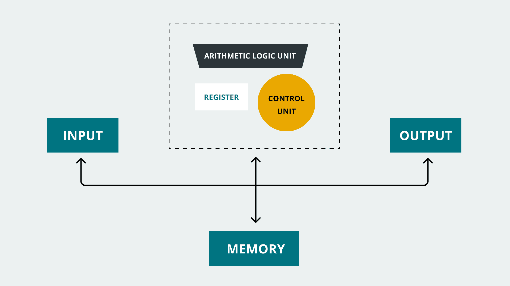
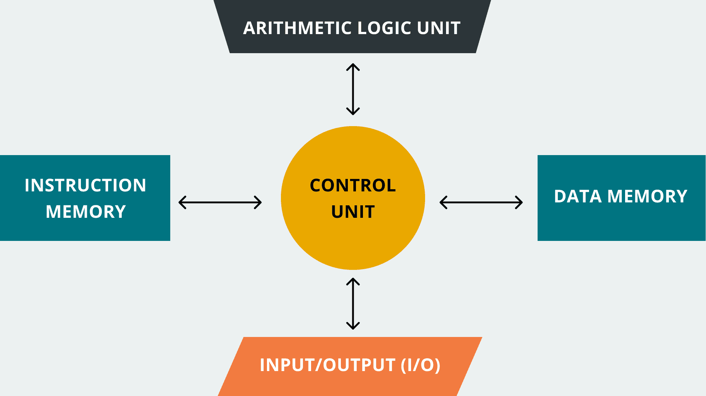
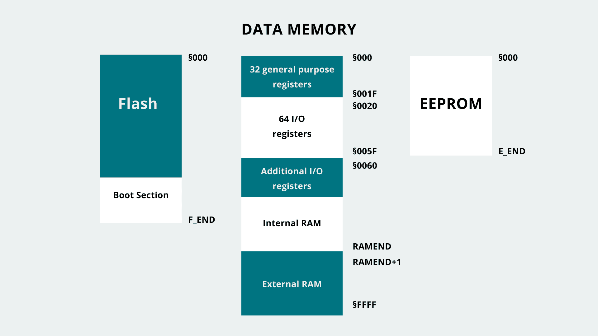
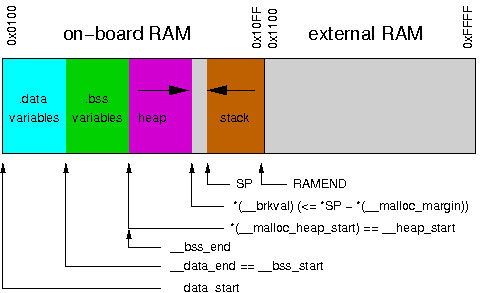

#### MemoryGuide
#### Руководство по памяти Arduino

В дополнение к очистке памяти следует разобраться с [памятью Arduino](https://docs.arduino.cc/learn/programming/memory-guide). 

Каждый микроконтроллер (также известный как MCU) представляет собой интегральную схему (IC), обычно используемую для выполнения цифровых приложений или задач. Одной из важных частей микроконтроллера является его память; память временно или постоянно хранит информацию в микроконтроллерах.

 Блоки памяти - это полупроводниковые устройства, которые хранят и извлекают  данные; центральный процессор микроконтроллера (CPU) использует и обрабатывает данные, хранящиеся в блоках памяти. Блоки памяти в микроконтроллерах обычно описываются как массивы. Массивы памяти разделены на ячейки, в которых могут храниться данные, и доступ к ним осуществляется с использованием уникального идентификатора, представляющего их адрес (местоположение в памяти). Информация в ячейках памяти хранится с использованием двоичных цифр (битов), обычно организованных в байты (8 бит); она также может быть извлечена позже MCU или другими компонентами системы на базе микроконтроллера.

Память в вычислительных системах может быть энергозависимой или энергонезависимой. Энергозависимая память - это временная память, это означает, что данные хранятся во время работы системы, но они теряются навсегда, когда система выключается. Энергонезависимая память - это постоянная память; данные не теряются, даже если система выключена.

Существуют две компьютерных архитектуры, то есть две системы организации компонентов внутри вычислительной системы: фон Неймана и Гарварда. 

Архитектура фон Неймана хранит программные данные и инструкции в одном блоке памяти. Доступ к ним осуществляется центральным процессором с использованием одной и той же коммуникационной шины. Архитектура фон Неймана является фундаментальной, поскольку почти все цифровые компьютеры были спроектированы на основе этой архитектуры.



Архитектура Гарварда использует два отдельных блока памяти, один для хранения программных инструкций, а другой для хранения программных данных. Доступ к обоим блокам памяти в архитектуре Гарварда осуществляется центральным процессором по разным коммуникационным шинам.



Платы Arduino в основном основаны на двух семействах микроконтроллеров: AVR и ARM. В то время как микроконтроллеры семейства AVR® основаны на архитектурной модели Harvard, микроконтроллеры семейства ARM® могут быть основаны либо на моделях архитектуры von Neuman, либо Harvard architectures. 

```
Плата          Микроконтроллер	Семья	      Архитектура

UNO 	           ATmega328P	AVR	          Гарвард
Leonardo	       ATmega32U4	AVR	          Гарвард
Mega 2560 Rev3     ATmega2560	AVR           Гарвард
Micro	           ATmega32U4	AVR           Гарвард
MKR FOX 1200       ATSAMD21G18	ARM Cortex M0 Von Neumann
Nano	           ATmega328P	AVR           Гарвард
Nano 33 BLE Sense  nRF52840	    ARM Cortex M4 Гарвард
```
Все различные блоки памяти внутри микроконтроллера можно разделить на два основных типа: ОЗУ и ПЗУ. Оперативная память (ОЗУ) в системах на базе микроконтроллеров - это энергозависимая память, используемая для хранения временных данных, таких как переменные встроенного ПО системы. ПЗУ (постоянная память) в системах на базе микроконтроллеров - это энергонезависимая память, используемая для хранения постоянных данных, таких как прошивка системы.

Оперативная память и ПЗУ в системах на базе микроконтроллеров подразделяются на три основные категории: **[Flash, ОЗУ, EEPROM]()**.

Флэш память в системах на базе микроконтроллеров является частью ПЗУ - это место, где хранится прошивка системы для выполнения. Например, Blink.ino: когда мы компилируем этот эскиз, мы создаем двоичный файл, который позже сохраняется во флэш-памяти платы Arduino. Затем эскиз выполняется при включении платы.

EEPROM - в системах на базе микроконтроллеров стираемая программируемая постоянная память, или EEPROM, также является частью ПЗУ; фактически, флэш-память является разновидностью EEPROM. Основное различие между флэш-памятью и EEPROM заключается в том, как ими управляют; EEPROM может управляться на уровне байтов (запись или стирание), в то время как Flash может управляться на уровне блоков.

Оперативная память (RAM) в системах на базе микроконтроллеров - это место, где хранятся временные данные системы или данные во время выполнения; например, переменные, созданные функциями программы. Оперативной памятью в микроконтроллерах обычно является SRAM; это тип оперативной памяти, который использует триггер для хранения одного бита данных. Существует также другой тип оперативной памяти, который можно найти в микроконтроллерах: DRAM.

Распределение памяти плат Arduino:



SRAM плат Arduino на основе [AVR]() организована по разным разделам: Text, Data, BSS, Stack, Heap.

[text]() раздел содержит инструкции, загруженные во флэш-память; [data]() раздел содержит переменные, инициализированные в скетче, [BSS]() раздел содержит неинициализированные данные, в [stack]() разделе хранятся данные о функциях и прерываниях, а в [heap]() разделе хранятся переменные, созданные во время выполнения.

В гибридных архитектурах [ARM]() реализована так называемая карта памяти с различной конфигурацией карты адресов - 32-разрядной, 36-разрядной и 40-разрядной, которая зависит от требований адресного пространства "Системы на кристалле" (SoC) с дополнительным DRAM. Карта памяти обеспечивает интерфейс с дизайном SoC, сохраняя при этом большую часть системного контроля за счет высокоуровневого кодирования. Инструкции доступа к памяти могут использоваться в высокоуровневом коде для управления модулями прерывания и встроенными периферийными устройствами. Все это контролируется [блоком управления памятью]() (MMU).

Основная роль MMU заключается в том, чтобы позволить процессору выполнять множество задач независимо в своем собственном пространстве виртуальной памяти; затем MMU использует таблицы преобразования для установления моста между адресами виртуальной и физической памяти. Виртуальным адресом управляют с помощью программного обеспечения с инструкциями по памяти, а физический адрес - это система памяти, которая управляется в зависимости от входных данных таблицы преобразования, задаваемых виртуальным адресом.


Память микроконтроллера на базе ARM разделена на следующие разделы:

виртуальный адрес - Kernel code and data (код ядра и данные), Application code and data;

физический адрес - ROM, RAM, Flash, Peripherals.


Данные о распределении памяти конкретной платы Arduino®:
```
Плата	         Flash    SRAM	EEPROM
UNO Mini         32 КБ	  2 КБ	  1 КБ
UNO Rev3         32 КБ	  2 КБ	  1 КБ
UNO WiFi Rev2	 48 КБ	  6 КБ	 256 B
Leonardo         32 КБ  2.5 KБ	  1 КБ
Mega            256 КБ    8 КБ	  4 КБ
Micro            32 КБ  2.5 KБ	  1 КБ
Ноль            256 КБ	 32 КБ       -
Nano             32 КБ	  2 КБ	  1 КБ
Nano 33 BLE Sense 1 МБ	256 КБ	     -
```
Аппаратная SDRAM и флэш-память Pro легко настраиваются по объему.

[Измерение использования флэш-памяти в платах Arduino.]()

Статистика использования памяти помогает понять, как управление ресурсами зависит от разработанной структуры кода. Потребность в загрузке памяти - это статистика, которая даст вам представление о том, насколько эффективен разработанный код. Это важный элемент при разработке, поскольку ресурсы внутри системы на базе микроконтроллера ограничены; программное обеспечение всегда должно работать без достижения максимальной грузоподъемности, чтобы избежать проблем. Загрузка памяти может наблюдаться либо в виде доступной оперативной памяти, имеющейся в распоряжении для конкретных задач, либо в виде оставшейся емкости флэш-памяти для требуемого запаса.
```
Чтобы избежать проблем во время выполнения, системы на базе микроконтроллеров всегда должны работать без достижения максимального объема памяти.
```
Флэш-память на платах Arduino измеряется уже с помощью Arduino IDE. Так как код приложения хранится во флэш-памяти,  то Arduino IDE сообщает об использовании флэш-памяти через консоль вывода компилятора.

Только выходные данные компилятора меняются в зависимости от того, основана ли плата на AVR или ARM.

[Карта памяти ОЗУ для чипов AVR](https://microsin.net/programming/avr/avr-gcc-memories-and-malloc.html) 

Стандартная карта памяти ОЗУ (RAM layout) должна разместить первыми переменные секции .data, от начала внутреннего RAM, и затем переменные секции .bss. Стек начинается от верхней границы внутреннего RAM, и растет к младшим адресам. Так называемая "куча" ("heap"), доступная для динамически выделяемой памяти, будет размещена за концом секции .bss. Таким образом нет риска, что динамическая память будет мешать переменным RAM (за исключением случая ошибочной реализации dynamic memory allocator). Однако все еще есть риск, что heap и стек пересекутся и затрут друг друга, если в программе будет задействовано слишком много места под динамическую память или под стек. [Такое может даже произойти, если выделения памяти были не большие, но создали со временем фрагментацию памяти, поскольку новые выделения блоков памяти перестали помещаться в "дырки" от ранее освобожденных областей](). Большие требования к стеку могут происходить в функции C, которая содержит большие локальные переменные или большое количество локальных переменных, или если функции с локальными переменными вызываются рекурсивно.



[Как определить, сколько осталось свободной оперативной памяти (RAM)](https://microsin.net/programming/avr/arduino-determining-amount-free-and-used-ram.html)

Это может оказаться полезным, когда скетч работает некорректно, и трудно определить причину ошибки. 

Количество свободной памяти может меняться с течением времени, пока работает Ваша программа. Очень важно удостовериться, что Вы не тратите больше памяти, чем имеется в наличии у системы.

Также в библиотеках часто объявляются константы и глобальные переменные, о которых Вы можете не знать, но они также расходуют RAM. У библиотеки Serial, например, есть глобальный массив из 128 байт, который используется как буфер для приходящих последовательных данных. Только это использует одну восьмую от общего объема памяти старого Arduino на микроконтроллере ATmega168.

```
void setup()
{
   Serial.begin(9600);
}
 
void loop()
{
   Serial.print(memoryFree()); // печать количества свободной оперативной памяти
   Serial.print(' ');          // печать пробела
   delay(1000);
}
 
// Переменные, создаваемые процессом сборки,
// когда компилируется скетч
extern int __bss_end;
extern void *__brkval;
 
// Функция, возвращающая количество свободного ОЗУ (RAM)
int memoryFree()
{
   int freeValue;
   if((int)__brkval == 0)
      freeValue = ((int)&freeValue) - ((int)&__bss_end);
   else
      freeValue = ((int)&freeValue) - ((int)__brkval);
   return freeValue;
}
```

После запуска этого варианта скетча Вы увидите, что количество памяти уменьшается, потому что каждая прокрутка цикла loop увеличивает размер строки. В какой-то момент память переполнится, и программа перестанет работать. Поэтому не увеличивайте размер строк сверх необходимого, и следите за их размером. Также будьте особенно внимательны с кодом, который использует динамическое выделение памяти. Не пишите код, который динамически создает разное количество переменных в зависимости от некоторых параметров во время своей работы, потому что очень сложно бывает найти ошибки во время выполнения кода, связанные с переполнением памяти.

Пользовательская функция [memoryFree](https://github.com/sudar/MemoryFree) использует системные переменные для вычисления количества свободной оперативной памяти RAM. Обычно системные переменные невидимы - они создаются компилятором для собственного использования (для управления внутренними ресурсами).

[Измерение памяти RAM для AVR]().

Иногда возникают ситуации, когда даже когда код успешно скомпилирован и загружен IDE на плату, он страдает от внезапных остановов. Эти проблемы, вероятно, связаны с перегрузкой ресурсов памяти или недостаточным объемом выделяемой памяти. Для решения этой проблемы необходимо понимать, в каком секторе кода потребность в памяти превышает доступные ресурсы. Следующий пример кода можно использовать для измерения использования SRAM в платах Arduino на основе [AVR]():

```
void display_freeram() 
{
  Serial.print(F("- SRAM left: "));
  Serial.println(freeRam());
}

int freeRam() 
{
  extern int __heap_start,*__brkval;
  int v;
  return (int)&v - (__brkval == 0  
    ? (int)&__heap_start : (int) __brkval);  
}
```

Помните, что в разделе heap хранятся переменные, созданные во время выполнения, где [__heap_start]() - начало раздела heap; [__brkval]() - указатель на последний адрес памяти в heap.


```
#include <EEPROM.h>

void setup() { }

void loop 
{
  // Write data into an specific address of the EEPROM memory 
  EEPROM.write(address, value);

  // Read data of an specific address of the EEPROM memory 
  EEPROM.read(address);
}
```
[Измерения использования SRAM в платах Arduino на базе ARM]():

```
extern "C" char* sbrk(int incr);

void display_freeram()
{
  Serial.print(F("- SRAM left: "));
  Serial.println(freeRam());
}

int freeRam() 
{
  char top;
  return &top - reinterpret_cast<char*>(sbrk(0));
}
```
Приведенный выше код взят из библиотеки Michael P. Flaga's [Arduino-MemoryFree](https://github.com/mpflaga/Arduino-MemoryFree).

[Измерение памяти EEPROM]()

Управление памятью EEPROM можно легко выполнять с помощью встроенных библиотек, уже установленных в Arduino IDE. The EEPROM библиотека может использоваться для чтения, записи и стирания данных из памяти EEPROM. Следующий код показывает, как байт информации может быть сохранен в памяти EEPROM, а затем считан с помощью write и read функции:
```
#include <EEPROM.h>

void setup() {}

void loop
{
  // Write data into an specific address of the EEPROM memory 
  EEPROM.write(address, value);

  // Read data of an specific address of the EEPROM memory 
  EEPROM.read(address);
}
```
Кроме того, можно очистить всю память EEPROM, установив для нее значение 0, как показано в приведенном ниже коде:
```
#include <EEPROM.h>

void setup() {}

void loop 
{
  for (int i = 0 ; i < EEPROM.length() ; i++) 
  {
    // Clear EEPROM memory 
    EEPROM.write(i, 0);
  }
}
```
Для получения дополнительной информации о том, как управлять памятью EEPROM, вы можете обратиться к [этому руководству](https://docs.arduino.cc/learn/programming/eeprom-guide).

[Оптимизация памяти SRAM с помощью строковой оболочки]().

Serial.print() или Serial.println() в инструкциях использует пространство SRAM, что может быть удобно, но нежелательно. Идеальный способ использовать в этом случае  флэш-память вместо SRAM, это применять функцию F() - строковую оболочку для литералов. Например:
```
Serial.println(F("Something"));
```
Здесь строка "Something" с помощью F() оболочки будет перемещена во флэш-память и не будет использоваться пространство SRAM. Используя F() можно наблюдать, как оболочка выгружает такие данные во флэш-память вместо SRAM. Флэш-память намного вместительнее, чем SRAM, поэтому лучше использовать пространство флэш-памяти, чем SRAM, которое будет использовать раздел heap. Это не означает, что место в памяти будет доступно всегда, поскольку место во флэш-памяти ограничено. Не рекомендуется засорять код Serial.print() или Serial.println() инструкциями, но используйте их там, где они наиболее важны внутри кода.

[Использование PROGMEM для хранения данных во флэш-памяти]().

Глобальные и статические переменные передаются потоком в пространство heap, которое может понадобиться стеку. PROGMEM, что расшифровывается как программная память, может использоваться для хранения переменных во флэш-памяти, точно так же, как F() оболочка, описанная ранее, но использование PROGMEM имеет один недостаток - скорость чтения данных. 

Использование оперативной памяти обеспечит гораздо более высокую скорость чтения данных, но PROGMEM поскольку в нем используется флэш-память, он будет работать медленнее ОЗУ при том же объеме данных. Таким образом, важно разрабатывать код, зная, какие переменные имеют решающее значение, а какие нет или имеют более низкий приоритет.

Использование PROGMEM в Arduino на базе AVR показано в следующем примере:
```
#include <avr/pgmspace.h>

// Basic PROGMEM structure 
const PROGMEM DataType Variable_Name[] = {var0, var1, var2 ...};

// Storing an unsigned, 16-bit, integer
const PROGMEM uint16_t NumSet[] = {0, 1, 1, 2, 3, 5, 8 ...};

// Storing a char in PROGMEM
const char greetMessage[] PROGMEM = {"Something"};
```
Вы можете прочитать больше о PROGMEM в [справочнике по языку Arduino](https://www.arduino.cc/reference/en/language/variables/utilities/progmem/).


###### [в начало](#memoryguide)

